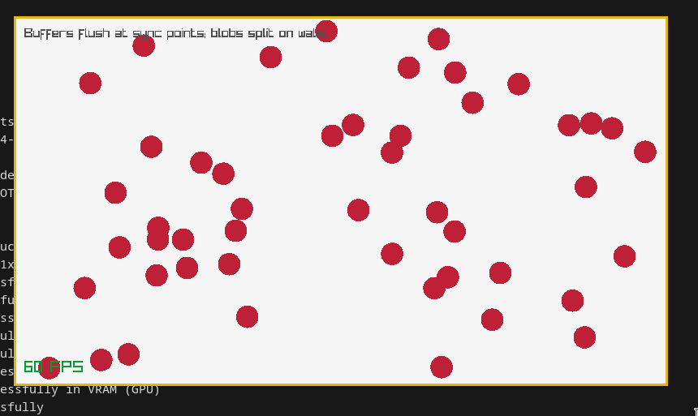

Giggy
=====

A handcrafted ECS in Zig, built the hard way while making a fun game (hopefully).

This ECS uses:
- Archetype-based storage
- Struct-of-Arrays (SoA) layout
- Compile-time reflection for components and metadata
- Explicit APIs with minimal hidden behavior

---

## Philosophy
- Build a real game, not a framework demo
- Favor clarity and explicitness over abstraction
- Accept refactors when real pain appears
- ECS exists to serve gameplay, not the other way around

---

## Roadmap

### ECS Core
- [x] Archetype storage with SoA-at-field-level layout
- [x] Component IDs (currently explicit, defined by `cid` field)
- [x] Safe append with rollback on allocation failure
- [x] Typed zero-copy component `View`s via field pointers

---

### World (Entity & Archetype Management)
- [x] World owns all archetypes
- [x] Entity spawning into correct archetypes
- [x] Entity despawning
- [x] Component access via `world.get(View, Entity)`
- [x] Query iteration across matching archetypes
- [X] Component `assign` & `unassign` with archetype migration

---

### Command Buffer
- [X] Decide command buffer data structure
- [X] Spawn with init components
- [X] Despawn a game entity
- [X] Assign components to a game entity
- [X] Unassign components from a game entity
- [X] Flush command buffer at a safe sync point to the world

---

### Minimal Game
The repo is already wired for a tiny playable loop: spawn entities, mutate components through the command buffer, and flush those commands into the `World`.

- [X] Define a mini-game
- [X] Define components — every struct that is a component needs a `pub const cid`
- [X] Spawn entities via `World.spawn` or `CommandBuffer.spawn`. Create bundles (structs with one component field per component) and let `Archetype.Meta.from` build the metadata
- [X] Mutate via command buffer — the buffer supported `spawn`, `despawn`, `assign`, and `unassign` commands
- [X] Read state via `world.get(View, entity)` or `world.getAuto(Component, entity)` to drive rendering / logic
- [X] Render game with Raylib



---

## Zen

```
$ zig zen

 * Communicate intent precisely.
 * Edge cases matter.
 * Favor reading code over writing code.
 * Only one obvious way to do things.
 * Runtime crashes are better than bugs.
 * Compile errors are better than runtime crashes.
 * Incremental improvements.
 * Avoid local maximums.
 * Reduce the amount one must remember.
 * Focus on code rather than style.
 * Resource allocation may fail; resource deallocation must succeed.
 * Memory is a resource.
 * Together we serve the users.
```
